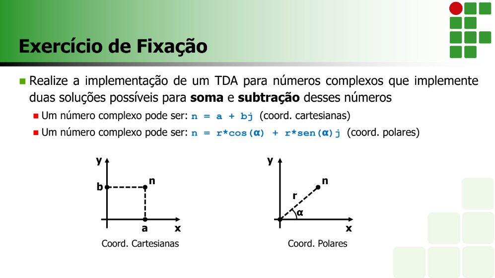

# Sobre o problema:




``````

Aula01/
├── main.py
├── classes/
│   ├── __init__.py
│   ├── RepresentacaoCartesiana.py
│   ├── RepresentacaoPolar.py
│   └── ...
├── testes/
│   ├── __init__.py
│   ├── test_RepresentacaoCartesiana.py
│   ├── test_RepresentacaoPolar.py
│   └── ...
└── README.md

``````

# Explicando organização do diretório: 

* main.py: Arquivo principal que contém o código para executar a aplicação.

* classes/: Pasta que contém os arquivos das classes criadas na aplicação. Cada arquivo deve conter a definição de uma classe. O arquivo __init__.py é necessário para que o Python reconheça essa pasta como um pacote.

* testes/: Pasta que contém os arquivos de teste para cada classe criada na aplicação. Cada arquivo deve conter os testes para uma única classe. O arquivo __init__.py é necessário para que o Python reconheça essa pasta como um pacote.